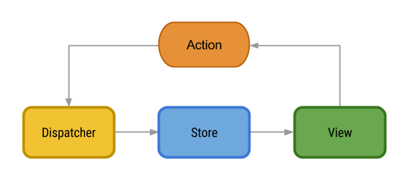

# MasseyHacks III Advanced Web Workshop

This workshop at MasseyHacks III goes through 2 main topics:
- Advanced CSS Styling
- Dynamic Frontend JavaScript with React

## Advanced CSS Styling
As opposed to the JavaScript portion of the workshop, this section will be mostly covered theoretically. Students are encouraged to experiment with and ask questions on the explained material as we go along.

### The Box Model
The CSS box model is (at least in my opinion) one of the most complex and intricate things there are in HTML. 

<br/>
*The CSS Box Model (image by W3C)*

It defines essentially how the size and shape of any HTML element behaves, from the content (the stuff within the tag), to the padding (the spacing around the stuff within the tag), to border (the line surrounding the padding), to the margins (the space surrounding the outside of the border). This allows us to pose (and, indeed, answer) some interesting questions that may follow:

> When I'm changing the width/height, what am I *actually* changing? **Answer:** This depends on the `box-sizing` property. 

> So, then, might the actual width/height differ from what I set? **Answer:** Yes, it often does! You can actually see a live representation of an elements box model within your browser:
```html 
<div style="height:20px;
    width:20px;
    padding-top:10px;
    border:1px solid black;
    margin-bottom:15px;"></div>
```
<br/>
*Chrome's interpretation of the above HTML*

#### What's in a line?

Try out a `<span>` tag. Notice it doesn't make a new line. Now try a `<div>`, notice it does make a new line! In CSS, there is a distinction between `inline` and `block` elements. In short, `inline` elements are, well, in the line - they do not affect the flow of the rest of the content. `block` elements, on the other hand, do. Unfortunately, many of the commands that work on `block` elements don't work on `inline` elements (ie. `width`, `height`, `top` and `bottom` margins....). To have elements stay on the same line but have these properties, try `inline-block`. <br/>
**CSS Display Properties** 
```css
selector{
    display: inline | block | inline-block;
}
```

#### Marginalia 
Setting `margin: 0 auto` (i.e. auto to both left and right ends) on a block element with a defined width will result in it centering itself on the page - cool! 


If you're ever bored at a web developer party, try out negative margins - they can make a box stretch beyond its parent container. 

### Positioning Elements
CSS has 4 major types of positioning: 
**CSS Positioning Properties** 
```css
selector{
    position: static | relative | absolute | fixed;
}
```
Put simply, these tags define.. well.. positioning. 
- Static is the default - it works as you expect
- Relative is equivalent to static in most ways, with two major exceptions:
    - It's capable of acting as a *positioned ancestor* (more on this later)
    - Positioning of elements (top, left, etc.) actually works and is relative the default position of the element
- Absolute positioning places the element with respect to the nearest *positioned* ancestor
- Fixed positioning works like absolute positioning, except it follows you down as you scroll

*Absolute* and *fixed* positioning are notable in that they are positioned relative to their nearest *positioned* ancestor, i.e. any element that is not `position:static`. This is a very powerful property that allows you to very exactly place elements.

##### But what about ordering? What goes on-top? 
All this positioning will invariably lead to layering issues. This is resolved with the `z-index` property, which is applicable to any positioned element. In essence, the higher the z-index of an element the "higher up" it is drawn - i.e. the element with the highest `z-index` will show up on top. 

One important thing to watch out for here is mixing `z-index`'s - applying `z-index` to a element *x* who's ancestors may already have a `z-index` applied. This creates a `stacking context`, which, in simple terms, means *x*'s `z-index` is only considered relative to that of sibling elements within the ancestor tag and makes no perceptible difference beyond that. 


### Flexboxes

Flexboxes take the traditional CSS model of positioning and throw it all out the window - as it turns out, placing a couple boxes side by side is way too hard the normal way. They're pretty easy to use: add `display:flex` to the container element and use the `flex` property on child elements to control ratios. For example, if you had 
```html
<div style="display:flex;">
    <div style="flex:3"></div>
    <div style="flex:7"></div>
</div>
```
You would have two columns side by side with ratio 3:7. Note these values do not need to add up to 10.

List of things you can specify:
```css
selector{
    flex: flex-grow flex-shrink flex-basis|auto|initial|inherit;
    display: flex;
    flex-direction: row|row-reverse|column|column-reverse|initial|inherit;
    flex-flow: flex-direction flex-wrap|initial|inherit;
    flex-wrap: nowrap|wrap|wrap-reverse|initial|inherit;
}
```

### CSS Transitions
Simply drop `transition: property speed;` in anywhere and your element will "transition" (animate) accordingly when you change that property. To transition everything, use `transition: all speed;`. This is particularly useful for state transitions like `:hover` and  states powered by JavaScript applied classes (e.g. `element.toggleClass('active')`)

Note: CSS Animations also exist, but are beyond the scope of this course. You may read about them here: 
https://developer.mozilla.org/en-US/docs/Web/CSS/animation

## JavaScript

The fun part - maybe. This section goes over basic programming with React and Redux. Let's get started! First, make sure you have Node.JS and NPM installed. 

### What is Node.JS and NPM? 

**Node.JS:** JavaScript running on your computer instead of your browser. That's it. 

**NPM:** NPM is the default package manager for Node.JS. Think of it as the "app store" for your javascript code. 

If you don't have these installed, head over to https://nodejs.org/en/ and download the latest release! 

### Getting started with Node.JS

Pop open your terminal and type the following: 
```bash
npm install create-react-app -g
```

The above command will install [create-react-app](https://github.com/facebookincubator/create-react-app) - a utility that makes React development a lot easier. Once you have that installed, head over to your project directory of choice and enter the following:
```bash
create-react-app masseyhacks3
```

Wait a couple seconds, and a folder for Massey Hacks 3 should materialize. This will be our working directory from here on out. 

Run `npm run start`, wait for your browser to popup with a spinning logo, and our magical unicorn ride is complete. 

### An overview of ES6 and JSX 

In case you've never worked with JavaScript before, let us first establish that it lacks many common features found in other languages - classes, imports, etc. 

Luckily, the creators of JavaScript realized this a little while back and decided to add them in with ES6 - the 6th edition of the ECMAScript standard (what JavaScript is based off of). 

Unfortunately, not all browsers support it at this time, which is why we need to use `npm` to convert it to a browser-friendly format for us. 

Secondly, React prefers to use a language called JSX - basically HTML inlined into JavaScript. As we will see, this presents us with some interesting challenges unto itself. 

Now, let's take a look at `src/App.js`. You'll find the following: 
```jsx
import React, { Component } from 'react';
import logo from './logo.svg';
import './App.css';

class App extends Component {
  render() {
    return (
      <div className="App">
        <div className="App-header">
          
          <h2>Welcome to React</h2>
        </div>
        <p className="App-intro">
          To get started, edit <code>src/App.js</code> and save to reload.
        </p>
      </div>
    );
  }
}
```

Note some interesting tidbits:
- `class` is replaced with `className` because it's a reserved keyword
- We imported `App.css` into a JavaScript file. This will be intelligently handled when everything is being converted into JavaScript
- Ditto with `logo.png`. Not only are we importing it, we're putting it into a `src` property by using `{variable}` instead of double quotes!

### React Philosophy

React works on the idea of components - each of which contains its own state and components. It centralizes around a `render` function - a method that is called to figure out what to output to the html.

#### States

React elements have a local state, which store information for the current component. You can set their value later on with `this.setState`, as demonstrated below:

```jsx
import React, {Component} from 'react';
class MyComponent extends Component{
    constructor(props){
        super(props);
        this.state = {
            on: false
        };
    }
    toggle(){
        this.setState({on: !this.state.on});
    }
    render(){
        return <button onClick={this.toggle.bind(this)}>{this.state.on ? "on": "off"}</button>
    }
}
```

#### Props

React elements also take `props` that take information from the parent. They are essentially just custom attributes provided by React. 
```jsx
import React, {Component} from 'react';
class MyComponent extends Component{
    render(){
        return <h1>{this.props.message}</h1>
    }
}
// <MyComponent message="test" /> ==> <h1>test</h1>
```

### Redux

With react comes along an entirely new idea for data - one way data binding. Take a look at the graphic below of the **flux architecture**:

 

*Flux Architecture (Credits @ http://lgvalle.xyz/)*

Redux works in a similar way, swapping out dispatches for *reducers*. Reducer functions take a state, an action, and spit out a new state.

```js
function myReducer(state={counter: 1}, action){
    switch(action.type){
        case "add":
            return {counter: state.counter+1};
        default:
            return state;
    }
}
``` 

The idea is that with React and Redux, we can keep *one-way dataflow* and as a result have everything be *declarative*. Let's write some code. 

First, hook up Redux.

*src/index.js*
```jsx
import React from 'react';
import ReactDOM from 'react-dom';
import App from './App';
import './index.css';
import { Provider } from 'react-redux'
import { createStore } from 'redux'

import todoReducer from "./reducers/todo";

const store = createStore(todoReducer)

ReactDOM.render(
  <Provider store={store}><App /></Provider>,
  document.getElementById('root')
);
```

*src/index.css*
```css
body {
  margin: 0;
  padding: 0;
  font-family: sans-serif;
}
```

*src/actions.js*
```js
import { connect } from "react-redux";
import { todo_actions } from "./reducers/todo.js";

const mapStateToProps = (state) => ({
    todos: state.todos
});

const mapDispatchToProps = (dispatch) => ({
    addTodo: (content) => dispatch({type: todo_actions.ADD_TODO, payload: content}),
    removeTodo: (index) => dispatch({type: todo_actions.REMOVE_TODO, payload: index})
});

export const map = (Component) => connect(
    mapStateToProps,
    mapDispatchToProps
)(Component);
```

*src/reducers/todo.js*
```js
export const todo_actions = {
  ADD_TODO: "add_todo",
  REMOVE_TODO: "remove_todo"
};

export default function todoReducer (state = { todos: [] }, action) {
    switch (action.type) {
        case todo_actions.ADD_TODO:
            state = { todos: [...state.todos, action.payload] };
            return state;
        case todo_actions.REMOVE_TODO:
            const todos = state.todos;
            todos.splice(action.payload, 1)
            state = { todos: [...todos] };
            return state;
        default:
            return state;
    }
}
```

*src/App.css* 
```css
.app{
    width:400px;
    margin:2em auto;
}
.app-title{
    font-size:1.5em;
}
.add-todo-input{
    display:block;
    width:100%;
    font-size:0.7em;
    box-sizing:border-box;
    padding:1em;
    margin-top:2em;
    border-radius:3px;
    border:1px solid #00BFFF;
}
.add-todo-input:focus{
    outline:none;
}
.add-todo-button{
    border-radius:3px;
    margin-top:0.5em;
    background:#00BFFF;
    color:#FFF;
    border-style:none;
    cursor:pointer;
    display:block;
    box-sizing:border-box;
    padding:1em;
    font-size:0.7em;
    width:100%;
    box-shadow:none;
    box-shadow:0px 4px 10px rgba(0,0,0,0.05);
    transition:all 200ms;

}
.add-todo-button:hover{
    box-shadow:0px 10px 20px rgba(0,0,0,0.1);
}
.add-todo-button:active{
    box-shadow:none;
}
.add-todo-button:focus{
    outline:none;
}
```

*src/App.js* 
```jsx
import React, { Component } from 'react';
import List from "./List";
import { map } from "./actions";
import './App.css';

class App extends Component {
  addTodo(){
    if(this.refs.input.value.length != 0){
      this.props.addTodo(this.refs.input.value);
      this.refs.input.value = "";
    }
  }
  render() {
    return (
      <div className="app">
        <h1 className="app-title">My Todo List</h1>
        <List />
        <input type="text" placeholder="Enter a todo" ref="input" className="add-todo-input" />
        <button onClick={this.addTodo.bind(this)} className="add-todo-button">Add Todo</button>
      </div>
    );
  }
}

export default map(App);
```

*src/List.js*
```jsx
import React, { Component } from 'react';
import { map } from "./actions";
import ListItem from "./ListItem";

class List extends Component {
  onClose(index){
    this.props.removeTodo(index);
  }
  render() {
    console.log(this.props);
    return (
      <div className="list">
          {this.props.todos.map((item, index) => <ListItem 
          key={item}
          name={item} 
          onClose={this.onClose.bind(this, index)} />)}
      </div>
    );
  }
}

export default map(List);

```

*src/ListItem.css*
```css
.listitem{
    border:1px solid #000;
    padding:0.7em 1.5em;
    font-size:0.8em;
    position:relative;
    margin-bottom:1em;
    overflow-x:hidden;
    border-radius:3px;
}
.listitem:hover .listitem-remove{
    transform:translateX(0);
}
.listitem-remove{
    position:absolute;
    right:0px;
    top:0px;
    border-radius:0px 3px 3px 0px;
    background:#000;
    color:#FFF;
    padding:0.7em;
    cursor:pointer;
    border-style:none;
    font-size:1em;
    transform: translateX(100%);   
    transition: transform 150ms;
}
.listitem-remove:focus{
    outline:none;
}
```

*src/ListItem.js*
```js
import React, { Component } from 'react';
import './ListItem.css';

class List extends Component {
  render() {
    return (
      <div className="listitem">
          {this.props.name}
          <button className="listitem-remove" onClick={this.props.onClose}>Done</button>
      </div>
    );
  }
}

export default List;
```