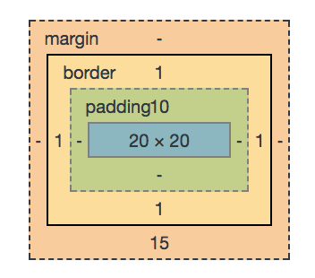

# MasseyHacks III Advanced Web Workshop

This workshop at MasseyHacks III goes through 2 main topics:
- Advanced CSS Styling
- Dynamic Frontend JavaScript with React

## Advanced CSS Styling
As opposed to the JavaScript portion of the workshop, this section will be mostly covered theoretically. Students are encouraged to experiment with and ask questions on the explained material as we go along.

### The Box Model
The CSS box model is (at least in my opinion) one of the most complex and intricate things there are in HTML. 

<br/>
*The CSS Box Model (image by W3C)*

It defines essentially how the size and shape of any HTML element behaves, from the content (the stuff within the tag), to the padding (the spacing around the stuff within the tag), to border (the line surrounding the padding), to the margins (the space surrounding the outside of the border). This allows us to pose (and, indeed, answer) some interesting questions that may follow:

> When I'm changing the width/height, what am I *actually* changing? **Answer:** This depends on the `box-sizing` property. 

> So, then, might the actual width/height differ from what I set? **Answer:** Yes, it often does! You can actually see a live representation of an elements box model within your browser:
```html 
<div style="height:20px;
    width:20px;
    padding-top:10px;
    border:1px solid black;
    margin-bottom:15px;"></div>
```
<br/>
*Chrome's interpretation of the above HTML*

#### What's in a line?

Try out a `<span>` tag. Notice it doesn't make a new line. Now try a `<div>`, notice it does make a new line! In CSS, there is a distinction between `inline` and `block` elements. In short, `inline` elements are, well, in the line - they do not affect the flow of the rest of the content. `block` elements, on the other hand, do. Unfortunately, many of the commands that work on `block` elements don't work on `inline` elements (ie. `width`, `height`, `top` and `bottom` margins....). To have elements stay on the same line but have these properties, try `inline-block`.
**CSS Display Properties** 
```css
selector{
    display: inline | block | inline-block;
}
```
#### Positioning Elements
CSS has 4 major types of positioning: 
**CSS Positioning Properties** 
```css
selector{
    position: static | relative | absolute | fixed;
}
```
