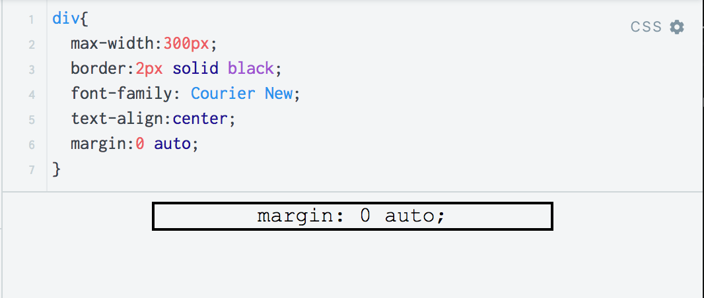

# MasseyHacks III Advanced Web Workshop

This workshop at MasseyHacks III goes through 2 main topics:
- Advanced CSS Styling
- Dynamic Frontend JavaScript with React

## Advanced CSS Styling
As opposed to the JavaScript portion of the workshop, this section will be mostly covered theoretically. Students are encouraged to experiment with and ask questions on the explained material as we go along.

### The Box Model
The CSS box model is (at least in my opinion) one of the most complex and intricate things there are in HTML. 

<br/>
*The CSS Box Model (image by W3C)*

It defines essentially how the size and shape of any HTML element behaves, from the content (the stuff within the tag), to the padding (the spacing around the stuff within the tag), to border (the line surrounding the padding), to the margins (the space surrounding the outside of the border). This allows us to pose (and, indeed, answer) some interesting questions that may follow:

> When I'm changing the width/height, what am I *actually* changing? **Answer:** This depends on the `box-sizing` property. 

> So, then, might the actual width/height differ from what I set? **Answer:** Yes, it often does! You can actually see a live representation of an elements box model within your browser:
```html 
<div style="height:20px;
    width:20px;
    padding-top:10px;
    border:1px solid black;
    margin-bottom:15px;"></div>
```
<br/>
*Chrome's interpretation of the above HTML*

#### What's in a line?

Try out a `<span>` tag. Notice it doesn't make a new line. Now try a `<div>`, notice it does make a new line! In CSS, there is a distinction between `inline` and `block` elements. In short, `inline` elements are, well, in the line - they do not affect the flow of the rest of the content. `block` elements, on the other hand, do. Unfortunately, many of the commands that work on `block` elements don't work on `inline` elements (ie. `width`, `height`, `top` and `bottom` margins....). To have elements stay on the same line but have these properties, try `inline-block`. <br/>
**CSS Display Properties** 
```css
selector{
    display: inline | block | inline-block;
}
```

#### Marginalia 
Setting `margin: 0 auto` (i.e. auto to both left and right ends) on a block element with a defined width will result in it centering itself on the page - cool! 


If you're ever bored at a web developer party, try out negative margins - they can make a box stretch beyond its parent container. 

### Positioning Elements
CSS has 4 major types of positioning: 
**CSS Positioning Properties** 
```css
selector{
    position: static | relative | absolute | fixed;
}
```
Put simply, these tags define.. well.. positioning. 
- Static is the default - it works as you expect
- Relative is equivalent to static in most ways, with two major exceptions:
    - It's capable of acting as a *positioned ancestor* (more on this later)
    - Positioning of elements (top, left, etc.) actually works and is relative the default position of the element
- Absolute positioning places the element with respect to the nearest *positioned* ancestor
- Fixed positioning works like absolute positioning, except it follows you down as you scroll

*Absolute* and *fixed* positioning are notable in that they are positioned relative to their nearest *positioned* ancestor, i.e. any element that is not `position:static`. This is a very powerful property that allows you to very exactly place elements.

##### But what about ordering? What goes on-top? 
All this positioning will invariably lead to layering issues. This is resolved with the `z-index` property, which is applicable to any positioned element. In essence, the higher the z-index of an element the "higher up" it is drawn - i.e. the element with the highest `z-index` will show up on top. 

One important thing to watch out for here is mixing `z-index`'s - applying `z-index` to a element *x* who's ancestors may already have a `z-index` applied. This creates a `stacking context`, which, in simple terms, means *x*'s `z-index` is only considered relative to that of sibling elements within the ancestor tag and makes no perceptible difference beyond that. 


### Flexboxes

Flexboxes take the traditional CSS model of positioning and throw it all out the window - as it turns out, placing a couple boxes side by side is way too hard the normal way. They're pretty easy to use: add `display:flex` to the container element and use the `flex` property on child elements to control ratios. For example, if you had 
```html
<div style="display:flex;">
    <div style="flex:3"></div>
    <div style="flex:7"></div>
</div>
```
You would have two columns side by side with ratio 3:7. Note these values do not need to add up to 10.

List of things you can specify:
```css
selector{
    flex: flex-grow flex-shrink flex-basis|auto|initial|inherit;
    display: flex;
    flex-direction: row|row-reverse|column|column-reverse|initial|inherit;
    flex-flow: flex-direction flex-wrap|initial|inherit;
    flex-wrap: nowrap|wrap|wrap-reverse|initial|inherit;
}
```

### CSS Transitions
Simply drop `transition: property speed;` in anywhere and your element will "transition" (animate) accordingly when you change that property. To transition everything, use `transition: all speed;`. This is particularly useful for state transitions like `:hover` and  states powered by JavaScript applied classes (e.g. `element.toggleClass('active')`)

Note: CSS Animations also exist, but are beyond the scope of this course. You may read about them here: 
https://developer.mozilla.org/en-US/docs/Web/CSS/animation
